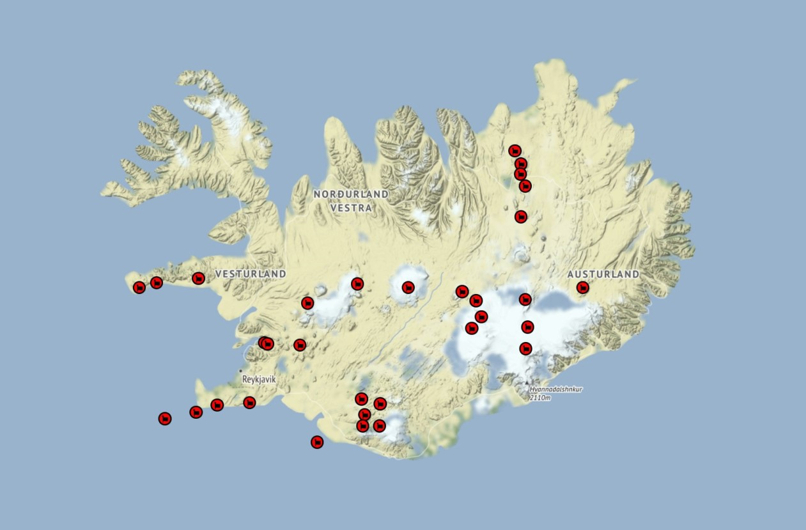
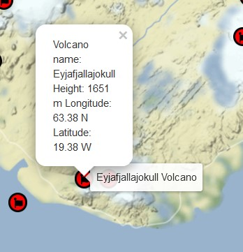

<h2>Python Volcano Map Project</h2>

This project creates an interactive html map with marked locations of Volcanoes in Iceland.<br>
It uses data available from Iceland Met Office which includes locations, height and names <br>
of all active and dormant volcanoes. I use pandas package to get the relevant data from file <br>
and folium package to draw the map and place the markers to my specifications.
<br>Project uses: python, pandas, folium, docker
<p float="left">
 	 

	
</p>

 


`code`
```python
import folium as fol
import pandas as pd
import folium.plugins


def create_map(file_name :str) -> None:

    map = fol.Map(location=[64.49,-18.14],
                  zoom_start=7,tiles="Stamen Terrain",
                  name="Volcanes Map")

    fg = fol.FeatureGroup(name="Volcanoes Map")

    data = pd.read_csv(file_name)

    lat = data["Unnamed: 3"][3:36].tolist()
    lon = data["Unnamed: 4"][3:36].tolist()
    names = data["Unnamed: 1"][3:36].tolist()
    height = data["Unnamed: 5"][3:36].tolist()

    for i in range (len(names)):
        latCor= ".".join([lat[i][1:3],lat[i][3:5]])
        lonCor= ".".join([lon[i][2:4],lon[i][4:6]])
               
        fg.add_child(fol.Marker(
                                tooltip=f"{names[i]} Volcano",
                                icon=(folium.plugins.BeautifyIcon(icon="fa volcano",
                                      background_color="red")
                                ),
                    location=(float(latCor)+0.32,-float(lonCor)-0.28),
                    popup=f"Volcano name: {names[i]} \
                    \nHeight: {height[i]}m\
                    \nLongitude: {latCor}N\
                    \nLatitude: {float(lonCor)}W")
                    )

    map.add_child(fg)
    map.save("map.html")


if __name__ == "__main__":
    create_map("./python/AviationTable.csv")
```
